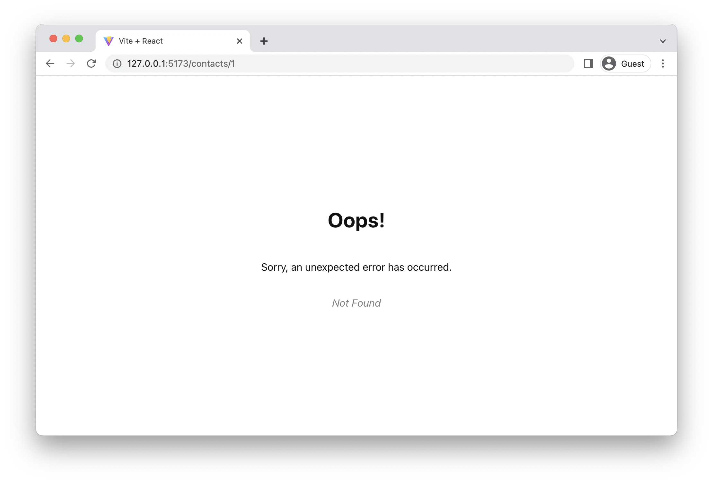
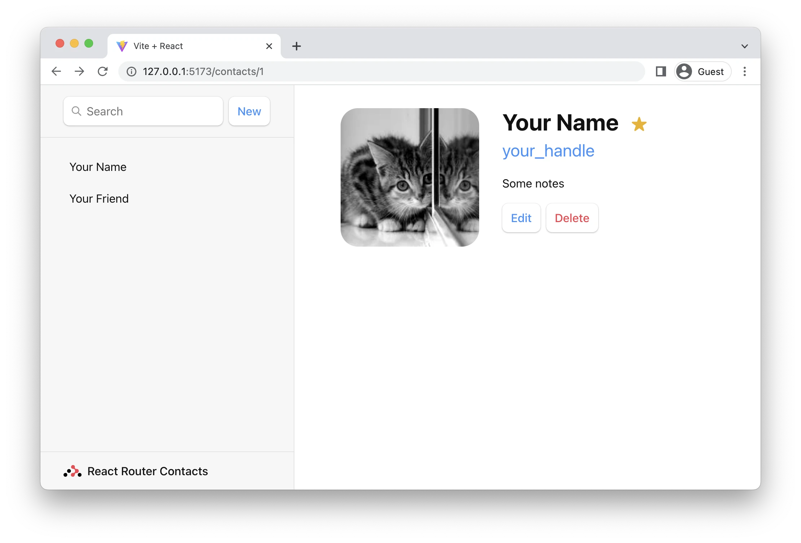
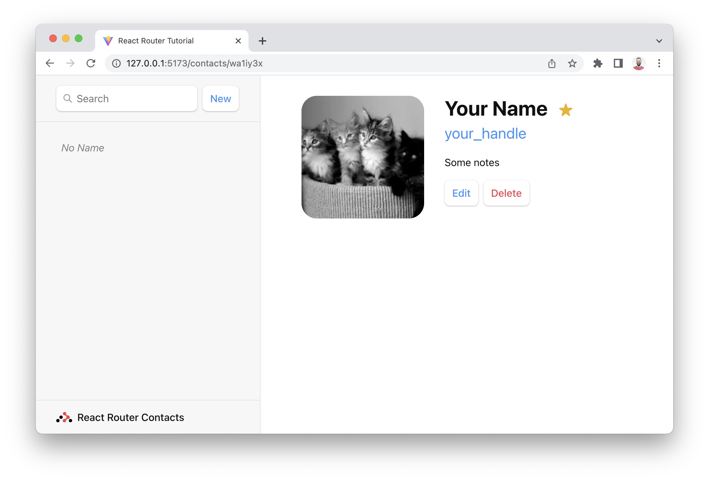
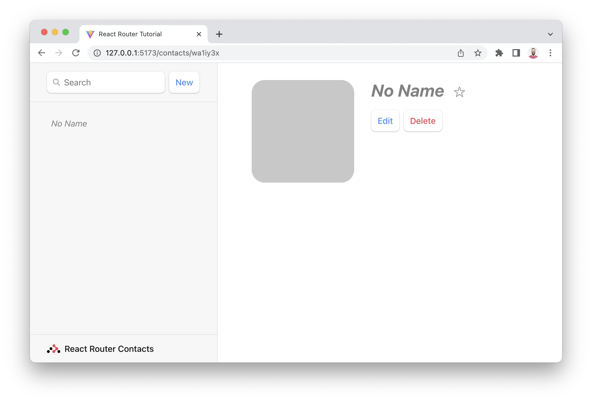
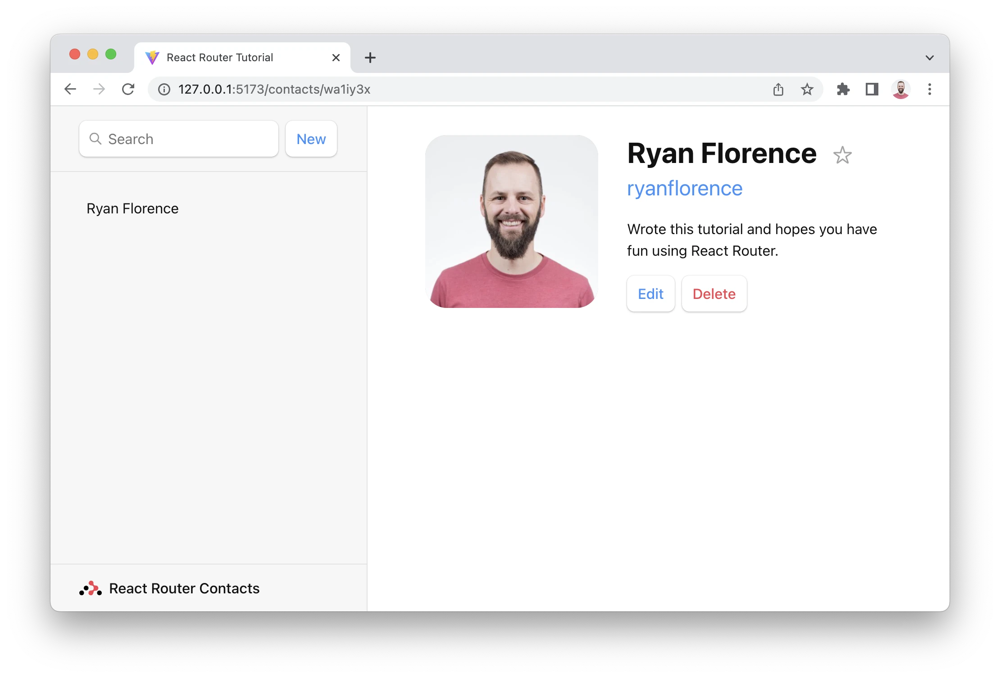
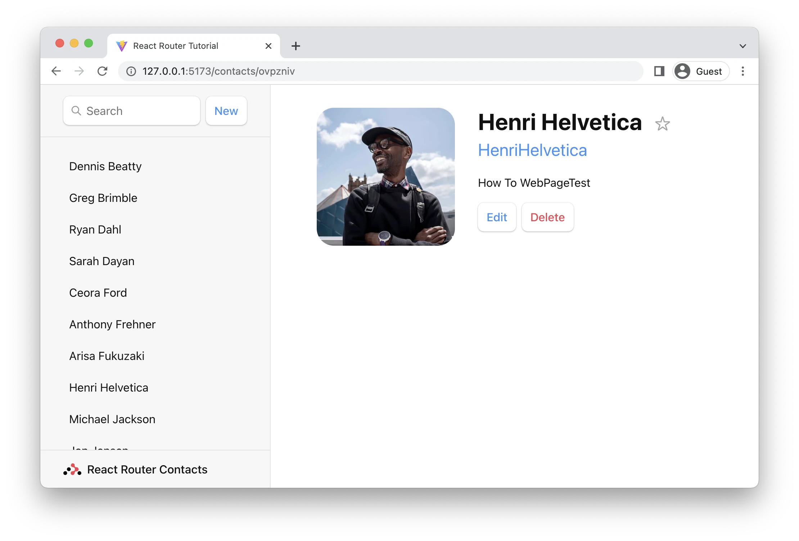
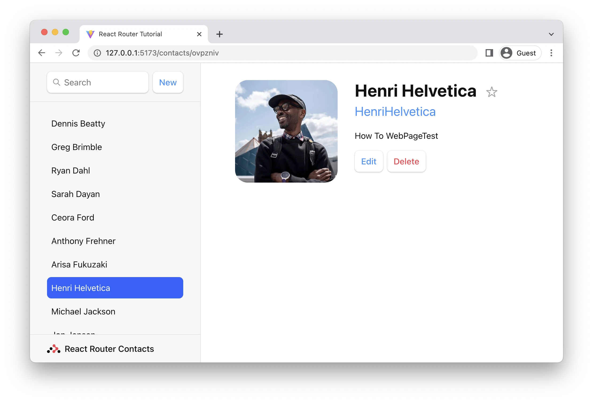
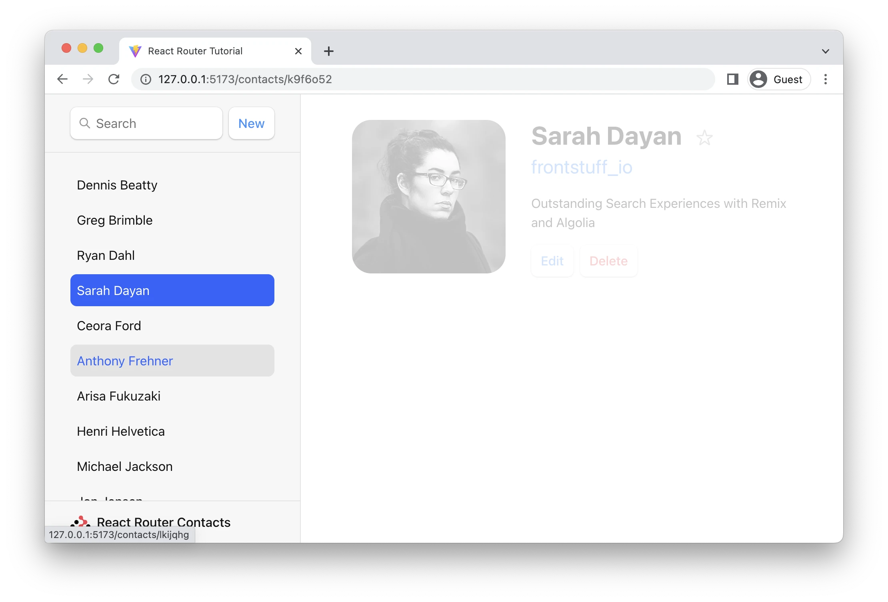

# Руководство

Добро пожаловать на урок! Мы создадим небольшое, но многофункциональное приложение, которое позволит вам отслеживать ваши контакты. Мы ожидаем, что это займет от 30 до 60 минут, если вы пойдете по плану.

Каждый раз, когда вы видите 👉, это означает, что вам нужно что-то сделать в приложении!

Остальное просто для вашей информации и более глубокого понимания. Давайте перейдем к делу.

- [Настройка](#настройка)
- [Добавление роутера](#добавление-роутера)
- [Корневой роут](#корневой-роут)
- [Обработка ошибок Not Found](#обработка-ошибок-not-found)
- [Маршурт contacts](#маршурт-contacts)
- [Вложенные маршруты](#вложенные-маршруты)
- [Маршрутизация на стороне клиента](#маршрутизация-на-стороне-клиента)
- [Загрузка данных](#загрузка-данных)
- [Запись данных + HTML-формы](#запись-данных--html-формы)
- [Создание контактов](#создание-контактов)
- [URL-параметры в loader](#url-параметры-в-loader)
- [Обновление данных](#обновление-данных)
- [Обновление контактов с помощью FormData](#обновление-контактов-с-помощью-formdata)
- [Мутация](#мутация)
- [Перенаправление новых записей на страницу edit](#перенаправление-новых-записей-на-страницу-edit)
- [Стилизация активной ссылки](#стилизация-активной-ссылки)
- [Глобальный UI для отправки данных](#глобальный-ui-для-отправки-данных)
- [Удаление записей](#удаление-записей)

## [Настройка](#руководство)

Если вы не собираетесь следовать инструкциям в своем приложении, вы можете пропустить этот раздел.

В этом уроке мы будем использовать `Vite` в качестве нашего сборщика и сервера разработки. Вам понадобится установленный `Node.js` для инструмента командной строки `npm`.

👉 Откройте свой терминал и загрузите новое приложение `React` с помощью `Vite`:

```bash
npm create vite@latest name-of-your-project -- --template react
# cледуйте подсказкам
cd <your new project directory>
npm install
npm install react-router-dom # всегда нужно!
npm install localforage match-sorter sort-by # только для этого урока.
npm run dev
```

Вы сможете открыть URL-адрес, напечатанный в терминале:

```bash
VITE v3.0.7  ready in 175 ms
  ➜  Local:   http://127.0.0.1:5173/
  ➜  Network: use --host to expose
```

Для этого урока у нас есть предварительно написанный CSS, поэтому мы можем сосредоточиться на `React Router`. Не стесняйтесь судить строго или писать свои собственные стили 😅 (Мы сделали вещи, которые обычно не делаем в CSS, чтобы разметка в этом уроке оставалась минимально возможной.)

👉 Скопируйте/вставьте CSS из файла `index.css` в `src/index.css`.

В этом руководстве будут описаны создание, чтение, поиск, обновление и удаление данных. Типичное веб-приложение, вероятно, будет взаимодействовать с API на вашем веб-сервере, но мы собираемся использовать хранилище браузера и имитировать некоторую задержку в сети, чтобы сосредоточиться на этом. Ни один из этих кодов не имеет отношения к `React Router`, поэтому просто скопируйте/вставьте все это.

👉 Скопируйте/вставьте модуль из файла `contacts.js` в `src/contacts.js`.

Все, что вам нужно в папке `src` — это `contacts.js`, `main.jsx` и `index.css`. Вы можете удалить все остальное (например, `App.js`, `assets` и т.д.).

👉 Удалите неиспользуемые файлы в `src/`, чтобы у вас остались только эти:

```bash
src
├── contacts.js
├── index.css
└── main.jsx
```

Если ваше приложение запущено, оно может на мгновение взорваться, просто продолжайте работу 😋. И вот мы готовы начать!

## [Добавление роутера](#руководство)

Первое, что нужно сделать, это создать `Browser Router` и настроить наш первый маршрут. Это позволит включить маршрутизацию на стороне клиента для нашего веб-приложения.

👉 Создайте и отрендерите `Browser Router` в `main.jsx`.

### src/main.jsx

```jsx
import * as React from 'react';
import * as ReactDOM from 'react-dom/client';
import { createBrowserRouter, RouterProvider } from 'react-router-dom';
import './index.css';

const router = createBrowserRouter([
  {
    path: '/',
    element: <div>Hello world!</div>,
  },
]);

ReactDOM.createRoot(document.getElementById('root')).render(
  <React.StrictMode>
    <RouterProvider router={router} />
  </React.StrictMode>
);
```

Этот первый маршрут мы часто называем «корневым маршрутом», поскольку остальные наши маршруты будут отображаться внутри него. Он будет служить корневым макетом пользовательского интерфейса, по мере продвижения у нас будут вложенные макеты.

## [Корневой роут](#руководство)

Давайте добавим глобальный макет для этого приложения.

👉 Создайте `src/routes` и `src/routes/root.jsx`

```bash
mkdir src/routes
touch src/routes/root.jsx
```

(Если вы не хотите быть занудой командной строки, используйте свой редактор вместо этих команд 🤓)

👉 Создайте компонент корневого макета

### src/routes/root.jsx

```jsx
export default function Root() {
  return (
    <>
      <div id="sidebar">
        <h1>React Router Contacts</h1>
        <div>
          <form id="search-form" role="search">
            <input id="q" aria-label="Search contacts" placeholder="Search" type="search" name="q" />
            <div id="search-spinner" aria-hidden hidden={true} />
            <div className="sr-only" aria-live="polite"></div>
          </form>
          <form method="post">
            <button type="submit">New</button>
          </form>
        </div>
        <nav>
          <ul>
            <li>
              <a href={`/contacts/1`}>Your Name</a>
            </li>
            <li>
              <a href={`/contacts/2`}>Your Friend</a>
            </li>
          </ul>
        </nav>
      </div>
      <div id="detail"></div>
    </>
  );
}
```

Пока ничего особенного для `React Router`, так что не стесняйтесь копировать/вставлять все это.

👉 Установите `<Root>` в качестве элемента корневого маршрута.

### src/main.jsx

```jsx
/* существующий импорт */
import Root from './routes/root';

const router = createBrowserRouter([
  {
    path: '/',
    element: <Root />,
  },
]);

ReactDOM.createRoot(document.getElementById('root')).render(
  <React.StrictMode>
    <RouterProvider router={router} />
  </React.StrictMode>
);
```

Приложение теперь должно выглядеть примерно так. Конечно, здорово иметь дизайнера, который еще и умеет писать CSS, не так ли? (Спасибо, Джим 🙏).


## [Обработка ошибок Not Found](#руководство)

Всегда полезно знать, как ваше приложение реагирует на ошибки на ранних этапах проекта, потому что при создании нового приложения мы все пишем гораздо больше ошибок, чем функций! Когда это произойдет, ваши пользователи не только получат приятные впечатления, но и помогут вам во время разработки.

Мы добавили в это приложение несколько ссылок. Давайте посмотрим, что произойдет, если мы нажмем на них?

👉 Нажмите одно из названий боковой панели.


Класс! Это экран ошибок по умолчанию в `React Router`, который вдобавок усугубляется нашими стилями `flex` в корневом элементе этого приложения 😂.

Каждый раз, когда ваше приложение выдает ошибку при рендеринге, загрузке данных или выполнении изменения данных, `React Router` улавливает ее и отображает экран ошибки. Давайте создадим собственную страницу ошибок.

👉 Создайте компонент `error-page`

```bash
touch src/error-page.jsx
```

### src/error-page.jsx

```jsx
import { useRouteError } from 'react-router-dom';

export default function ErrorPage() {
  const error = useRouteError();
  console.error(error);

  return (
    <div id="error-page">
      <h1>Oops!</h1>
      <p>Sorry, an unexpected error has occurred.</p>
      <p>
        <i>{error.statusText || error.message}</i>
      </p>
    </div>
  );
}
```

👉 Установите `<ErrorPage>` в качестве `errorElement` корневого маршрута.

### src/main.jsx

```jsx
/* Предыдущий импорт */
import ErrorPage from './error-page';

const router = createBrowserRouter([
  {
    path: '/',
    element: <Root />,
    errorElement: <ErrorPage />,
  },
]);

ReactDOM.createRoot(document.getElementById('root')).render(
  <React.StrictMode>
    <RouterProvider router={router} />
  </React.StrictMode>
);
```

Страница ошибки теперь должна выглядеть так:



(Ну, это не намного лучше. Может быть, кто-то забыл попросить дизайнера создать страницу с ошибкой. Может быть, все забывают попросить дизайнера создать страницу с ошибкой, а затем обвиняют дизайнера в том, что он не подумал об этом 😆)

Обратите внимание, что `useRouteError` предоставляет возникшую ошибку. Когда пользователь переходит к несуществующим маршрутам, вы получите ответ в `error` в поле `statusText` сообщение `Not Found`. Позже в этом руководстве мы увидим некоторые другие ошибки и обсудим их подробнее.

На данный момент достаточно знать, что почти все ваши ошибки теперь будут обрабатываться этой страницей, а не бесконечно крутящимися прелоадерами, неотвечающими страницами или пустыми экранами 🙌.

## [Маршурт contacts](#руководство)

Вместо страницы `404 "Not Found"` мы хотим отображать что-то по URL-адресам, на которые мы ссылаемся. Для этого нам нужно проложить новый маршрут.

👉 Создайте модуль маршрута `contact`

```bash
touch src/routes/contact.jsx
```

👉 Добавьте туда код компонента `Сontact`

### src/routes/contact.jsx

```jsx
import { Form } from 'react-router-dom';

export default function Contact() {
  const contact = {
    first: 'Your',
    last: 'Name',
    avatar: 'https://robohash.org/you.png?size=200x200',
    twitter: 'your_handle',
    notes: 'Some notes',
    favorite: true,
  };

  return (
    <div id="contact">
      <div>
        
      </div>

      <div>
        <h1>
          {contact.first || contact.last ? (
            <>
              {contact.first} {contact.last}
            </>
          ) : (
            <i>No Name</i>
          )}{' '}
          <Favorite contact={contact} />
        </h1>

        {contact.twitter && (
          <p>
            <a target="_blank" href={`https://twitter.com/${contact.twitter}`}>
              {contact.twitter}
            </a>
          </p>
        )}

        {contact.notes && <p>{contact.notes}</p>}

        <div>
          <Form action="edit">
            <button type="submit">Edit</button>
          </Form>
          <Form
            method="post"
            action="destroy"
            onSubmit={event => {
              if (!confirm('Please confirm you want to delete this record.')) {
                event.preventDefault();
              }
            }}
          >
            <button type="submit">Delete</button>
          </Form>
        </div>
      </div>
    </div>
  );
}

function Favorite({ contact }) {
  const favorite = contact.favorite;
  return (
    <Form method="post">
      <button
        name="favorite"
        value={favorite ? 'false' : 'true'}
        aria-label={favorite ? 'Remove from favorites' : 'Add to favorites'}
      >
        {favorite ? '★' : '☆'}
      </button>
    </Form>
  );
}
```

Теперь, когда у нас есть компонент, давайте подключим его к новому маршруту.

👉 Импортируйте компонент `Contact` и создайте новый маршрут.

### src/main.jsx

```jsx
/* существующий импорт */
import Contact from './routes/contact';

const router = createBrowserRouter([
  {
    path: '/',
    element: <Root />,
    errorElement: <ErrorPage />,
  },
  {
    path: 'contacts/:contactId',
    element: <Contact />,
  },
]);

/* существующий код */
```

Теперь, если мы кликнем на одну из ссылок или посетим `/contacts/1`, мы получим наш новый компонент!


Однако его нет внутри нашего корневого макета 😠.

## [Вложенные маршруты](#руководство)

Мы хотим, чтобы компонент `Contact` отображался внутри макета `<Root>` следующим образом.



Мы получим это, сделав маршрут `contact` дочерним по отношению к корневому маршруту.

👉 Переместите маршрут `contacts`, чтобы он был дочерним по отношению к корневому маршруту.

### src/main.jsx

```jsx
const router = createBrowserRouter([
  {
    path: '/',
    element: <Root />,
    errorElement: <ErrorPage />,
    children: [
      {
        path: 'contacts/:contactId',
        element: <Contact />,
      },
    ],
  },
]);
```

Теперь вы снова увидите корневой макет, но пустую страницу справа. Нам нужно указать корневому маршруту, где мы хотим, чтобы он отображал свои дочерние маршруты. Мы делаем это с помощью `<Outlet>`.

Найдите `<div id="detail">` и поместите внутри `<Outlet>`.

👉 Отрендерите `<Outlet>`

### src/routes/root.jsx

```jsx
import { Outlet } from 'react-router-dom';

export default function Root() {
  return (
    <>
      {/* все остальные элементы */}
      <div id="detail">
        <Outlet />
      </div>
    </>
  );
}
```

## [Маршрутизация на стороне клиента](#руководство)

Возможно, вы заметили, а могли и не заметить, но когда мы нажимаем ссылки на боковой панели, браузер выполняет полный запрос документа для следующего URL-адреса вместо использования `React Router`.

Маршрутизация на стороне клиента позволяет нашему приложению обновлять URL-адрес, не запрашивая другой документ с сервера. Вместо этого приложение может немедленно отобразить новый пользовательский интерфейс. Давайте сделаем это с помощью `<Link>`.

👉 Измените боковую панель `<a href>` на `<Link to>`.

### src/routes/root.jsx

```jsx
import { Outlet, Link } from 'react-router-dom';

export default function Root() {
  return (
    <>
      <div id="sidebar">
        {/* другие элементы */}

        <nav>
          <ul>
            <li>
              <Link to={`contacts/1`}>Your Name</Link>
            </li>
            <li>
              <Link to={`contacts/2`}>Your Friend</Link>
            </li>
          </ul>
        </nav>

        {/* другие элементы */}
      </div>
    </>
  );
}
```

Вы можете открыть вкладку сети в инструментах разработчика браузера и убедиться, что он больше не запрашивает документы.

## [Загрузка данных](#руководство)

Сегменты URL, макеты и данные чаще всего связаны вместе. Мы уже видим это в этом приложении:

```bash
URL Segment	        Component	       Data
/	                  <Root>	         cписок контактов
contacts/:id	      <Contact>	       индивидуальный контакт
```

Из-за этой естественной связи в `React Router` есть соглашения о данных, позволяющие легко вносить данные в компоненты вашего маршрута.

Для загрузки данных мы будем использовать два API: `loader` и `useLoaderData`. Сначала мы создадим и экспортируем функцию `loader` в корневой модуль, затем подключим ее к маршруту. Наконец, мы получим доступ к данным и отобразим их.

👉 Экспортируйте `loader` из `root.jsx`

### src/routes/root.jsx

```jsx
import { Outlet, Link } from 'react-router-dom';
import { getContacts } from '../contacts';

export async function loader() {
  const contacts = await getContacts();
  return { contacts };
}
```

👉 Настройте `loader` на маршруте

### src/main.jsx

```jsx
/* Другой импорт */
import Root, { loader as rootLoader } from './routes/root';

const router = createBrowserRouter([
  {
    path: '/',
    element: <Root />,
    errorElement: <ErrorPage />,
    loader: rootLoader,
    children: [
      {
        path: 'contacts/:contactId',
        element: <Contact />,
      },
    ],
  },
]);
```

👉 Создайте доступ и отрендерите данные

### src/routes/root.jsx

```jsx
import { Outlet, Link, useLoaderData } from 'react-router-dom';
import { getContacts } from '../contacts';

/* другой код */
export default function Root() {
  const { contacts } = useLoaderData();
  return (
    <>
      <div id="sidebar">
        <h1>React Router Contacts</h1>
        {/* другой код */}
        <nav>
          {contacts.length ? (
            <ul>
              {contacts.map(contact => (
                <li key={contact.id}>
                  <Link to={`contacts/${contact.id}`}>
                    {contact.first || contact.last ? (
                      <>
                        {contact.first} {contact.last}
                      </>
                    ) : (
                      <i>No Name</i>
                    )}{' '}
                    {contact.favorite && <span>★</span>}
                  </Link>
                </li>
              ))}
            </ul>
          ) : (
            <p>
              <i>No contacts</i>
            </p>
          )}
        </nav>
        {/* другой код */}
      </div>
    </>
  );
}
```

Вот и все! `React Router` теперь будет автоматически синхронизировать эти данные с вашим пользовательским интерфейсом. У нас пока нет данных, поэтому вы, вероятно, получите такой пустой список:


## [Запись данных + HTML-формы](#руководство)

Через секунду мы создадим наш первый контакт, но сначала давайте поговорим о HTML.

`React Router` эмулирует навигацию по HTML-формам в качестве примитива изменения данных, согласно веб-разработкам до кембрийского взрыва JavaScript. Он дает вам UX-возможности клиентских приложений с простой веб-моделью «старой школы».

HTML-формы, хотя и незнакомы некоторым веб-разработчикам, на самом деле вызывают навигацию в браузере, точно так же, как щелчок по ссылке. Единственное отличие заключается в запросе: ссылки могут изменять только URL-адрес, а формы также могут изменять метод запроса (`GET` или `POST`) и тело запроса (данные формы `POST`).

Без маршрутизации на стороне клиента браузер автоматически сериализует данные формы и отправляет их на сервер в качестве тела запроса для `POST` и как `URLSearchParams` для `GET`. `React Router` делает то же самое, за исключением того, что вместо отправки запроса на сервер он использует маршрутизацию на стороне клиента и отправляет его в `action` маршрута.

Мы можем проверить это, нажав кнопку `New` в нашем приложении. Приложение должно взорваться, потому что сервер `Vite` не настроен для обработки запроса `POST` (он отправляет `404`, хотя, вероятно, это должен быть `405` 🤷).


Вместо того, чтобы отправлять этот `POST` на сервер `Vite` для создания нового контакта, давайте вместо этого будем использовать маршрутизацию на стороне клиента.

## [Создание контактов](#руководство)

Мы создадим новые контакты, экспортировав `action` в наш корневой маршрут, подключив его к конфигурации маршрута и изменив нашу `<form>` на `<Form>` из `React Router`.

👉 Создайте action и измените `<form>` на `<Form>`

### src/routes/root.jsx

```jsx
import { Outlet, Link, useLoaderData, Form } from 'react-router-dom';
import { getContacts, createContact } from '../contacts';

export async function action() {
  const contact = await createContact();
  return { contact };
}

/* другой код */

export default function Root() {
  const { contacts } = useLoaderData();
  return (
    <>
      <div id="sidebar">
        <h1>React Router Contacts</h1>
        <div>
          {/* другой код */}
          <Form method="post">
            <button type="submit">New</button>
          </Form>
        </div>

        {/* другой код */}
      </div>
    </>
  );
}
```

👉 Импортируйте и установите action на маршруте

### src/main.jsx

```jsx
/* другие импорты */
import Root, { loader as rootLoader, action as rootAction } from './routes/root';

const router = createBrowserRouter([
  {
    path: '/',
    element: <Root />,
    errorElement: <ErrorPage />,
    loader: rootLoader,
    action: rootAction,
    children: [
      {
        path: 'contacts/:contactId',
        element: <Contact />,
      },
    ],
  },
]);
```

Вот и все! Нажмите кнопку `New`, и вы увидите новую запись в списке 🥳.


Метод `createContact` просто создает пустой контакт без имени, данных или чего-либо еще. Но запись все же создается, обещаем!

🧐 Подождите... Как обновилась боковая панель? Где мы вызвали `action`? Где код для получения данных? Где `useState`, `onSubmit` и `useEffect`?!

Именно здесь проявляется модель программирования «старой школы веба». Как мы обсуждали ранее, `<Form>` не позволяет браузеру отправлять запрос на сервер и вместо этого отправляет его в `action` вашего маршрута. В веб-семантике `POST` обычно означает, что некоторые данные изменяются. По соглашению `React Router` использует это как подсказку для автоматической повторной проверки данных на странице после завершения `action`. Это означает, что все ваши перехватчики `useLoaderData` обновляются, и пользовательский интерфейс автоматически синхронизируется с вашими данными! Довольно круто.

## [URL-параметры в loader](#руководство)

👉 Нажмите на запись `No Name`.

Мы должны снова увидеть нашу старую статическую страницу contact, с одним отличием: URL-адрес теперь имеет реальный идентификатор записи.



Просматривая конфигурацию маршрута, маршрут выглядит следующим образом:

```jsx
[
  {
    path: 'contacts/:contactId',
    element: <Contact />,
  },
];
```

Обратите внимание на сегмент URL `:contactId`. Двоеточие (`:`) имеет особое значение, превращая его в «динамический сегмент». Динамические сегменты будут соответствовать динамическим (меняющимся) значениям в этой позиции URL-адреса, например ID контакта. Мы называем эти значения в URL-адресе «URL Params (Параметры URL)» или для краткости просто «params (параметры)».

Эти `params` передаются `loader` с ключами, соответствующими динамическому сегменту. Например, наш сегмент называется `:contactId`, поэтому значение будет передано как `params.contactId`.

Эти параметры чаще всего используются для поиска записи по id. Давайте попробуем.

👉 Добавьте `loader` на страницу `contact` и получите доступ к данным с помощью `useLoaderData`.

### src/routes/contact.jsx

```jsx
import { Form, useLoaderData } from 'react-router-dom';
import { getContact } from '../contacts';

export async function loader({ params }) {
  const contact = await getContact(params.contactId);
  return { contact };
}

export default function Contact() {
  const { contact } = useLoaderData();
  // существующий код
}
```

👉 Настройте `loader` на маршруте

### src/main.jsx

```jsx
/* существующий код */
import Contact, { loader as contactLoader } from './routes/contact';

const router = createBrowserRouter([
  {
    path: '/',
    element: <Root />,
    errorElement: <ErrorPage />,
    loader: rootLoader,
    action: rootAction,
    children: [
      {
        path: 'contacts/:contactId',
        element: <Contact />,
        loader: contactLoader,
      },
    ],
  },
]);
/* существующий код */
```



## [Обновление данных](#руководство)

Точно так же, как и при создании данных, вы обновляете данные с помощью `<Form>`. Давайте создадим новый маршрут `contacts/:contactId/edit`. Опять же, мы начнем с компонента, а затем подключим его к конфигурации маршрута.

👉 Создайте компонент Edit

```bash
touch src/routes/edit.jsx
```

👉 Добавьте UI страницы edit

Ничего такого, чего мы раньше не видели, не стесняйтесь копировать/вставлять:

### src/routes/edit.jsx

```jsx
import { Form, useLoaderData } from 'react-router-dom';

export default function EditContact() {
  const { contact } = useLoaderData();

  return (
    <Form method="post" id="contact-form">
      <p>
        <span>Name</span>
        <input placeholder="First" aria-label="First name" type="text" name="first" defaultValue={contact?.first} />
        <input placeholder="Last" aria-label="Last name" type="text" name="last" defaultValue={contact?.last} />
      </p>
      <label>
        <span>Twitter</span>
        <input type="text" name="twitter" placeholder="@jack" defaultValue={contact?.twitter} />
      </label>
      <label>
        <span>Avatar URL</span>
        <input
          placeholder="https://example.com/avatar.jpg"
          aria-label="Avatar URL"
          type="text"
          name="avatar"
          defaultValue={contact?.avatar}
        />
      </label>
      <label>
        <span>Notes</span>
        <textarea name="notes" defaultValue={contact?.notes} rows={6} />
      </label>
      <p>
        <button type="submit">Save</button>
        <button type="button">Cancel</button>
      </p>
    </Form>
  );
}
```

👉 Добавьте новый маршрут edit

### src/main.jsx

```jsx
/* существующий код */
import EditContact from './routes/edit';

const router = createBrowserRouter([
  {
    path: '/',
    element: <Root />,
    errorElement: <ErrorPage />,
    loader: rootLoader,
    action: rootAction,
    children: [
      {
        path: 'contacts/:contactId',
        element: <Contact />,
        loader: contactLoader,
      },
      {
        path: 'contacts/:contactId/edit',
        element: <EditContact />,
        loader: contactLoader,
      },
    ],
  },
]);

/* существующий код */
```

Мы хотим, чтобы он отображался в outlet корневого маршрута, поэтому мы сделали его родственным по отношению к существующему дочернему маршруту.

(Вы можете заметить, что мы повторно использовали `contactLoader` для этого маршрута. Это только потому, что мы ленились в руководстве. Нет причин пытаться разделить загрузчики между маршрутами, у них обычно есть свои собственные.)

Хорошо, нажатие кнопки `Edit` открывает нам новый пользовательский интерфейс:


## [Обновление контактов с помощью FormData](#руководство)

Маршрут `edit`, который мы только что создали, уже отображает форму. Все, что нам нужно сделать для обновления записи, — это подключить `action` к маршруту. Форма опубликует `action`, и данные будут автоматически проверены.

👉 Добавьте `action` в модуль `edit`

### src/routes/edit.jsx

```jsx
import { Form, useLoaderData, redirect } from 'react-router-dom';
import { updateContact } from '../contacts';

export async function action({ request, params }) {
  const formData = await request.formData();
  const updates = Object.fromEntries(formData);
  await updateContact(params.contactId, updates);
  return redirect(`/contacts/${params.contactId}`);
}

/* существующий код */
```

👉 Свяжите `action` с маршрутом

### src/main.js

```jsx
/* существующий код */
import EditContact, { action as editAction } from './routes/edit';

const router = createBrowserRouter([
  {
    path: '/',
    element: <Root />,
    errorElement: <ErrorPage />,
    loader: rootLoader,
    action: rootAction,
    children: [
      {
        path: 'contacts/:contactId',
        element: <Contact />,
        loader: contactLoader,
      },
      {
        path: 'contacts/:contactId/edit',
        element: <EditContact />,
        loader: contactLoader,
        action: editAction,
      },
    ],
  },
]);

/* существующий код */
```

Заполните форму, нажмите `save`, и вы увидите что-то вроде этого! (За исключением того, что он приятнее для глаз и, возможно, менее волосатый)



## [Мутация](#руководство)

😑 Это работает, но я понятия не имею, что здесь происходит...

Давайте покопаемся немного...

Откройте `src/routes/edit.jsx` и посмотрите на элементы формы. Обратите внимание, что у каждого из них есть имя:

### src/routes/edit.jsx

```jsx
<input placeholder="First" aria-label="First name" type="text" name="first" defaultValue={contact.first} />
```

Без JavaScript при отправке формы браузер создаст [`FormData`](https://developer.mozilla.org/en-US/docs/Web/API/FormData) и установит его в качестве тела запроса при отправке на сервер. Как упоминалось ранее, React Router предотвращает это и отправляет запрос в ваш `action`, включая [`FormData`](https://developer.mozilla.org/en-US/docs/Web/API/FormData).

Каждое поле формы доступно с помощью `formData.get(name)`. Например, учитывая поле ввода сверху, вы можете получить доступ к `first` и `last` следующим образом:

```jsx
export async function action({ request, params }) {
  const formData = await request.formData();
  const firstName = formData.get('first');
  const lastName = formData.get('last');
  // ...
}
```

Поскольку у нас есть несколько полей формы, мы использовали [`Object.fromEntries`](https://developer.mozilla.org/en-US/docs/Web/JavaScript/Reference/Global_Objects/Object/fromEntries), чтобы собрать их все в объект, а это именно то, чего хочет наша функция `updateContact`.

Помимо `action`, ни один из этих API, которые мы обсуждаем, не предоставляется React Router: [`request`](https://developer.mozilla.org/en-US/docs/Web/API/Request), [`request.formData`](https://developer.mozilla.org/en-US/docs/Web/API/Request/formData), [`Object.fromEntries`](https://developer.mozilla.org/en-US/docs/Web/JavaScript/Reference/Global_Objects/Object/fromEntries) не предоставляются веб-платформой.

После того, как мы завершили `action`, обратите внимание на [`redirect`](https://reactrouter.com/en/main/fetch/redirect) в конце:

### src/routes/edit.jsx

```jsx
export async function action({ request, params }) {
  const formData = await request.formData();
  const updates = Object.fromEntries(formData);
  await updateContact(params.contactId, updates);
  return redirect(`/contacts/${params.contactId}`);
}
```

И `Loaders` и `actions` могут возвращать ответ [`Response`](https://reactrouter.com/en/main/route/loader#returning-responses) (имеет смысл, поскольку они получили запрос [`Request`](https://developer.mozilla.org/en-US/docs/Web/API/Request)!). Хелпер `redirect` просто упрощает возврат [`response`](https://developer.mozilla.org/en-US/docs/Web/API/Response), который сообщает приложению сменить местоположение.

Без маршрутизации на стороне клиента, если сервер перенаправляет после запроса POST, новая страница будет получать последние данные и отображать их. Как мы узнали ранее, React Router эмулирует эту модель и автоматически повторно проверяет данные на странице после выполнения `action`. Вот почему боковая панель автоматически обновляется, когда мы сохраняем форму. Дополнительный код повторной проверки не существует без маршрутизации на стороне клиента, поэтому он также не должен существовать при маршрутизации на стороне клиента!

## [Перенаправление новых записей на страницу edit](#руководство)

Теперь, когда мы знаем, как перенаправить, давайте обновим `action`, который создает новые контакты для перенаправления на страницу редактирования:

👉 Перенаправьте на страницу редактирования новый записи

### src/routes/root.jsx

```jsx
import { Outlet, Link, useLoaderData, Form, redirect } from 'react-router-dom';
import { getContacts, createContact } from '../contacts';

export async function action() {
  const contact = await createContact();
  return redirect(`/contacts/${contact.id}/edit`);
}
```

Теперь, когда мы нажимаем `New`, мы должны оказаться на странице редактирования:


👉 Добавьте несколько записей

Например звездный состав спикеров с первой Remix Conference 😁.



## [Стилизация активной ссылки](#руководство)

Теперь, когда у нас есть куча записей, неясно, на какую из них мы смотрим на боковой панели. Мы можем использовать [`NavLink`](https://reactrouter.com/en/main/components/nav-link), чтобы исправить это.

👉 Используйте NavLink на боковой панели

### src/routes/root.jsx

```jsx
import { Outlet, NavLink, useLoaderData, Form, redirect } from 'react-router-dom';

export default function Root() {
  return (
    <>
      <div id="sidebar">
        {/* другой код */}

        <nav>
          {contacts.length ? (
            <ul>
              {contacts.map(contact => (
                <li key={contact.id}>
                  <NavLink
                    to={`contacts/${contact.id}`}
                    className={({ isActive, isPending }) => (isActive ? 'active' : isPending ? 'pending' : '')}
                  >
                    {/* другой код */}
                  </NavLink>
                </li>
              ))}
            </ul>
          ) : (
            <p>{/* другой код */}</p>
          )}
        </nav>
      </div>
    </>
  );
}
```

Обратите внимание, что мы передаем `className`. Когда пользователь находится на URL в `NavLink`, `isActive` будет `true`. Когда он собирается стать активным (данные все еще загружаются), `isPending` будет true. Это позволяет нам легко указать, где находится пользователь, а также предоставить немедленную обратную связь по ссылкам, по которым был выполнен щелчок, но мы все еще ждем загрузки данных.



## [Глобальный UI для отправки данных](#руководство)

Когда пользователь перемещается по приложению, React Router оставит старую страницу открытой, пока загружаются данные для следующей страницы. Вы могли заметить, что приложение немного не отвечает, когда вы щелкаете между списками. Давайте предоставим пользователю некоторую обратную связь, чтобы приложение не чувствовало себя неотзывчивым.

React Router управляет всем состоянием за кулисами и раскрывает его части, необходимые для создания динамических веб-приложений. В этом случае мы будем использовать хук `useNavigation`.

👉 используйте `useNavigation`, чтобы добавить глобальный UI для отправки данных

### src/routes/root.jsx

```jsx
import {
  // существующий код
  useNavigation,
} from 'react-router-dom';

// существующий код

export default function Root() {
  const { contacts } = useLoaderData();
  const navigation = useNavigation();

  return (
    <>
      <div id="sidebar">{/* существующий код */}</div>
      <div id="detail" className={navigation.state === 'loading' ? 'loading' : ''}>
        <Outlet />
      </div>
    </>
  );
}
```

[`useNavigation`](https://reactrouter.com/en/main/hooks/use-navigation) возвращает текущее состояние навигации: оно может быть одним из `"idle" | "submitting" | "loading"`.

В нашем случае мы добавляем класс `loading` к основной части приложения, если мы не бездействуем. Затем CSS добавляет красивое затухание после небольшой задержки (чтобы избежать мерцания пользовательского интерфейса при быстрой загрузке). Хотя вы можете сделать все, что захотите, например, показать спиннер или полосу загрузки сверху.



Обратите внимание, что наша модель данных (`src/contacts.js`) имеет кэш на стороне клиента, поэтому переход к тому же контакту во второй раз происходит быстрее. Такое поведение не является поведением React Router, оно будет повторно загружать данные для изменения маршрутов независимо от того, были ли вы там раньше или нет. Однако оно избегает вызова `loader` для неизменяемых маршрутов (например, списка) во время навигации.

## [Удаление записей](#руководство)

Если мы просмотрим код в `route` контакта, мы обнаружим, что кнопка удаления выглядит следующим образом:

### src/routes/contact.jsx

```jsx
<Form
  method="post"
  action="destroy"
  onSubmit={event => {
    if (!confirm('Please confirm you want to delete this record.')) {
      event.preventDefault();
    }
  }}
>
  <button type="submit">Delete</button>
</Form>
```

Обратите внимание на `action="destroy"`. Как и `<Link to>`, `<Form action>` может принимать относительное значение. Поскольку форма отображается в `contact/:contactId`, то `action` с `destroy` отправит форму в `contact/:contactId/destroy` при нажатии.

На этом этапе вы должны знать все, что вам нужно знать, чтобы кнопка удаления работала. Может, попробовать, прежде чем двигаться дальше? Вам понадобиться:

- Новый `route`
- `action` на этом `route`
- `deleteContact` из `src/contacts.js`

👉 Создайте модуль маршрута `destroy`

```bash
touch src/routes/destroy.jsx
```

👉 Добавьте action `destroy`

### src/routes/destroy.jsx

```jsx
import { redirect } from 'react-router-dom';
import { deleteContact } from '../contacts';

export async function action({ params }) {
  await deleteContact(params.contactId);
  return redirect('/');
}
```

👉 Добавьте маршрут `destroy` в конфигурацию маршрутов.

### src/main.jsx

```jsx
/* существующий код */
import { action as destroyAction } from './routes/destroy';

const router = createBrowserRouter([
  {
    path: '/',
    /* существующий код */
    children: [
      /* существующий код */
      {
        path: 'contacts/:contactId/destroy',
        action: destroyAction,
      },
    ],
  },
]);

/* существующий код */
```

Хорошо, перейдите к записи и нажмите кнопку `Delete`. Оно работает!

...😅 Я до сих пор не понимаю, почему это все работает...

Когда пользователь нажимает кнопку submit:

1. `<Form>` предотвращает стандартное поведение браузера при отправке нового запроса POST на сервер, а вместо этого эмулирует браузер, создавая запрос POST с маршрутизацией на стороне клиента.
2. `<Form action="destroy">` соответствует новому маршруту в `contacts/:contactId/destroy` и отправляет ему запрос.
3. После перенаправления action React Router вызывает все загрузчики данных на странице, чтобы получить последние значения (это «повторная проверка»). `useLoaderData` возвращает новые значения и вызывает обновление компонентов!

Добавьте форму, добавьте action, все остальное сделает React Router.
