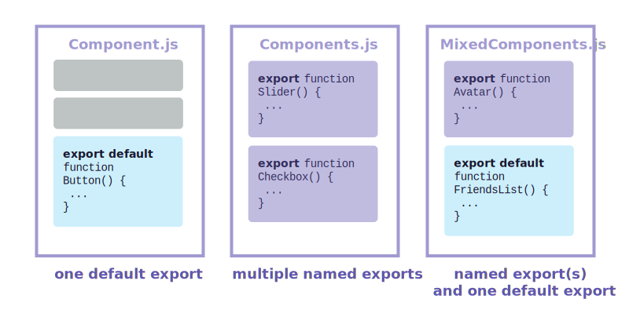

# [Импорт и экспорт компонентов](../../index.md)

- [Введение](#введение)

## [Введение](#импорт-и-экспорт-компонентов)

**Магия компонентов заключается в их повторном использовании: вы можете создавать компоненты, состоящие из других компонентов. Но по мере того, как вы вкладываете все больше и больше компонентов, часто имеет смысл начать разделять их на разные файлы. Это позволяет вам сохранять файлы простыми для сканирования и повторно использовать компоненты в большем количестве мест.**

### Ты выучишь

- Что такое файл корневого компонента
- Как импортировать и экспортировать компонент
- Когда использовать импорт и экспорт по умолчанию и именованный
- Как импортировать и экспортировать несколько компонентов из одного файла
- Как разделить компоненты на несколько файлов

## [Корневой файл компонента](#импорт-и-экспорт-компонентов)

В главе [Your First Component](<./1. Your First Component.md>) вы создали компонент `Profile` и компонент `Gallery`, который его отображает:

```jsx
// App.js
function Profile() {
  return ;
}

export default function Gallery() {
  return (
    <section>
      <h1>Amazing scientists</h1>
      <Profile />
      <Profile />
      <Profile />
    </section>
  );
}
```

В настоящее время они находятся в **файле корневого компонента**, который в этом примере называется `App.js`. Однако в зависимости от настроек корневой компонент может находиться в другом файле. Если вы используете фреймворк с маршрутизацией на основе файлов, например `Next.js`, корневой компонент будет отличаться для каждой страницы.

## [Экспорт и импорт компонента](#импорт-и-экспорт-компонентов)

Что делать, если вы захотите изменить целевую страницу в будущем и разместить там список научных книг? Или разместить все профили где-то еще? Имеет смысл переместить `Gallery` и `Profile` из файла корневого компонента. Это сделает их более модульными и пригодными для повторного использования в других файлах. Вы можете переместить компонент в три шага:

1. **Создайте** новый JS-файл для размещения компонентов.
2. **Экспортируйте** свой функциональный компонент из этого файла (используя [экспорт по умолчанию](https://developer.mozilla.org/docs/Web/JavaScript/Reference/Statements/export#using_the_default_export) или [именованный](https://developer.mozilla.org/docs/Web/JavaScript/Reference/Statements/export#using_named_exports)).
3. **Импортируйте** его в файл, в котором вы будете использовать компонент (используя соответствующий метод [импорта по умолчанию](https://developer.mozilla.org/docs/Web/JavaScript/Reference/Statements/import#importing_defaults) или [именованный](https://developer.mozilla.org/docs/Web/JavaScript/Reference/Statements/import#import_a_single_export_from_a_module)).

Здесь и `Profile`, и `Gallery` были перемещены из `App.js` в новый файл `Gallery.js`. Теперь вы можете изменить `App.js`, чтобы импортировать `Gallery` из `Gallery.js`:

```jsx
// App.js
import Gallery from './Gallery.js';

export default function App() {
  return <Gallery />;
}
```

```jsx
// Gallery.js
function Profile() {
  return ;
}

export default function Gallery() {
  return (
    <section>
      <h1>Amazing scientists</h1>
      <Profile />
      <Profile />
      <Profile />
    </section>
  );
}
```

Обратите внимание, что этот пример теперь разбит на два файла-компонента:

- Gallery.js:
  - Определяет компонент `Profile`, который используется только в том же файле и не экспортируется.
  - Экспортирует компонент `Gallery` в качестве **экспорта по умолчанию**.
- App.js:
  - Импортирует `Gallery` в качестве **импорта по умолчанию** из `Gallery.js`.
  - Экспортирует корневой компонент `App` в качестве **экспорта по умолчанию**.

### Примечание

> Вы можете встретить файлы, у которых отсутствует расширение `.js`, например:

```jsx
import Gallery from './Gallery';
```

> В React будет работать как `./Gallery.js`, так и `./Gallery`, хотя первый ближе к тому, как работают [нативные модули ES](https://developer.mozilla.org/docs/Web/JavaScript/Guide/Modules).

### Подробнее

Экспорт по умолчанию или именованный экспорт.

Существует два основных способа экспорта значений с помощью JavaScript: экспорт по умолчанию и именованный экспорт. До сих пор в наших примерах использовались только экспорты по умолчанию. Но вы можете использовать один или оба из них в одном файле. **Файл может иметь не более одного экспорта по умолчанию, но он может иметь столько именованных экспортов, сколько вам нужно**.



То, как вы экспортируете свой компонент, определяет, как вы должны его импортировать. Вы получите сообщение об ошибке, если попытаетесь импортировать экспорт по умолчанию так же, как и именованный экспорт! Эта диаграмма поможет вам отслеживать:

| Синтаксис    | Экспорт                               | Импорт                                 |
| :----------- | :------------------------------------ | :------------------------------------- |
| по умолчанию | `export default function Button() {}` | `import Button from './Button.js'`     |
| именованный  | `export function Button() {}`         | `import { Button } from './Button.js'` |

Когда вы пишете импорт по умолчанию, вы можете указать любое имя после импорта. Например, вы можете написать `import Banana from './Button.js'` вместо этого и это все равно предоставит вам тот же экспорт по умолчанию. Напротив, при именованном импорте имя должно совпадать с обеих сторон. Вот почему их называют **именованным** импортом!

**Люди часто используют экспорт по умолчанию, если файл экспортирует только один компонент, и используют именованный экспорт, если он экспортирует несколько компонентов и значений.** Независимо от того, какой стиль вы предпочитаете, всегда давайте осмысленные имена функциям вашего компонента и файлам, которые их содержат. Компоненты без имен, например, `export default () => {}`, не рекомендуются, поскольку они усложняют отладку.

## [Экспорт и импорт нескольких компонентов из одного файла](#импорт-и-экспорт-компонентов)

Что делать, если вы хотите показать только один `Profile` вместо галереи? Вы также можете экспортировать компонент `Profile`. Но `Gallery.js` уже имеет экспорт по умолчанию, и вы не можете иметь _два_ экспорта по умолчанию. Вы можете создать новый файл с экспортом по умолчанию или добавить именованный экспорт для `Profile`. **Файл может иметь только один экспорт по умолчанию, но он может иметь несколько именованных экспортов!**

### Примечание

> Чтобы уменьшить потенциальную путаницу между экспортом по умолчанию и именованным экспортом, некоторые команды предпочитают придерживаться только одного стиля (по умолчанию или именованный) или избегать их смешивания в одном файле. Делайте то, что лучше всего подходит вам!
